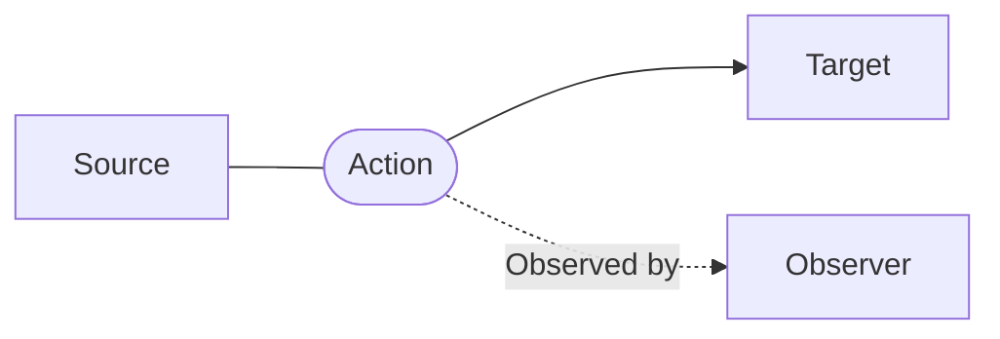

A [[Simulae]] Event is a data structure intended to represent as many types of 'events' as possible from a high abstract level to a very minute incremental time-scale

[[Simulae Event]]'s are a class derived from the [[Simulae]] base structure ([[SimulaeNode]]) which are intended to take advantage of it's flexibility while still being able to accommodate the abstract nature of representing an 'event'

## Event Structure

```json
Event = {
	References: {
		"class": ...,
		"type": ...,
		"subtype": ...,
	},
	Attributes: {
		'start_timestamp': ...,
		'end_timestamp': ...,
	},
	Relations: {
		"sources": {
			...
		},
		"targets": {
		...
		},
		"observers": {
			...
		}
	}
	...
}
```





