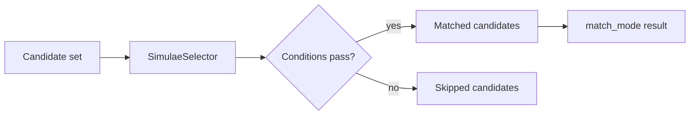

[[Selector]] filters a set of candidates using one or more [[Simulae Condition]] rules.

A condition answers "does this one candidate match?"

A selector answers "which candidates in this set match?"

## Implementation

`SimulaeSelector` is a lightweight helper class.

Core fields:
- `conditions`: a list of `SimulaeCondition` objects
- `match_all`: when `True`, every condition must pass; when `False`, any condition may pass
- `match_mode`: controls what `select()` returns

Supported match modes:
- `all`: return all matching candidates
- `first`: return the first matching candidate
- `last`: return the last matching candidate
- `any`: return `True` if at least one candidate matches
- `none`: return `True` if no candidates match

Selectors work with plain JSON-like objects and [[SimulaeNode]] objects because they delegate property extraction to [[Simulae Condition]].

## Features & Usage

Use a selector when an action or effect needs to choose targets from a set.

Written examples:

- Select all POI nodes with health above 100:
  - Condition 1: `[Nodetype] == Person`
  - Condition 2: `[Attributes, health] > 100`
  - Match mode: `all`

- Check whether any OBJ node is powered:
  - Condition 1: `[Nodetype] == Object`
  - Condition 2: `[Checks, powered] == True`
  - Match mode: `any`

- Select the first valid target:
  - Use the same conditions
  - Match mode: `first`

Selectors are often used as `acceptance_selector` inputs for [[Simulae Action]].
