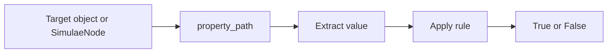

[[Simulae Condition]] is a small rule object that answers one question:

> Does this target have the expected property value?

It works with both regular JSON-like objects and [[SimulaeNode]] objects, including nested SimulaeNodes inside [[Relations]].

## Implementation

`SimulaeCondition` is implemented as a meta [[SimulaeNode]] with nodetype `Condition`.

Core fields:
- `property_path`: a list path such as `[Attributes, health]` or `[Relations, Components, Object, heart, Checks, beating]`
- `rule`: a `ConditionRuleType`
- `value`: the comparison value, when the rule needs one
- `exclusivity`: range boundary settings for range rules

Supported rule groups:
- Existence: exists, not exists
- Equality: equals, not equals
- Numeric: less than, greater than, ranges
- String: contains, regex match
- List: contains, not contains

Condition extraction normalizes each SimulaeNode it reaches into its public node dictionaries:
`ID`, `Nodetype`, `References`, `Attributes`, `Relations`, `Checks`, `Abilities`, `Scales`, and `Memory`.

That is what allows the same condition to work on a plain JSON object or a real nested SimulaeNode.

## Features & Usage

Use a condition when you want to test one candidate.

Written examples:

- A person is wounded:
  - Path: `[Attributes, health]`
  - Rule: less than
  - Value: `100`

- A light is powered:
  - Path: `[Checks, powered]`
  - Rule: equals
  - Value: `True`

- A body has a heart nested in its composition relations:
  - Path: `[Relations, Components, Object, human_body, Relations, Components, Object, heart]`
  - Rule: exists

Use [[Selector]] when you need to apply one or more conditions across a list of candidates.
