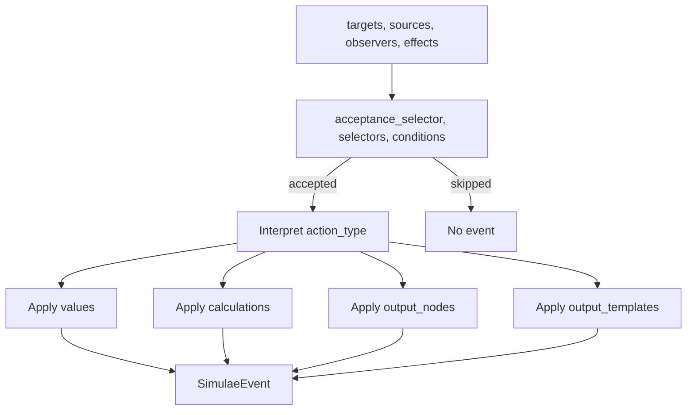

[[Simulae Action]] is a world update performed by a [[Simulae Effect]].

Actions are intentionally simple. They accept a small set of flexible inputs that can describe many kinds of updates.

## Implementation

`SimulaeAction` is implemented as a meta [[SimulaeNode]] with nodetype `Action`.

Core fields:
- `action_type`: the kind of action, such as `update`, `increment`, `compose`, `decompose`, `transmute`, `trigger_effect`, or `create_event`
- `conditions`: optional action-local [[Simulae Condition]] gates
- `selectors`: optional [[Selector]] gates
- `acceptance_selector`: the main selector used to decide which target nodes this action accepts
- `values`: path-based assignments or removals
- `calculations`: path-based numeric changes
- `output_nodes`: SimulaeNodes to add, remove, compose, decompose, or transmute through relations
- `output_templates`: event templates, nested effects, or path/value templates

The main execution method is `act()`.

`apply()` is an alias for `act()` so [[Simulae Effect]] can call actions consistently.

Both methods accept only:
- `targets`: possible target nodes
- `sources`: nodes or IDs causing the action
- `observers`: nodes or IDs observing the action
- `effects`: effects associated with the action

Both methods return only created [[Simulae Event]] objects.

### Action Flow

## Features & Usage

Use an action for one actual change.

Common uses:
- Update node state, such as health, checks, abilities, references, or memory
- Increment or decrement numeric attributes
- Compose or decompose relation nodes
- Transmute one node into another
- Trigger another [[Simulae Effect]]
- Create one or more [[Simulae Event]] objects

Written examples:

- Heal a target:
  - `action_type`: `increment`
  - `values`: `{ "Attributes.health": 10 }`

- Turn on a light:
  - `action_type`: `update`
  - `values`: `{ "Abilities.emit_light": "on" }`
  - `calculations`: decrement `Attributes.electricity` by `1`

- Stabilize bleeding:
  - `action_type`: `update`
  - `values`:
    - `Checks.bleeding = False`
    - `Abilities.heal = stabilized`

- Transmute scrap into an improvised weapon:
  - `action_type`: `transmute`
  - `output_nodes`:
    - remove `scrap` from `Relations.Contents`
    - add `improvised_weapon` to `Relations.Contents`

- Create a damage event:
  - `action_type`: `create_event`
  - `output_templates`:
    - `class`: `physical`
    - `type`: `damage`
    - `subtype`: `organ-puncture`

Returned events include:
- that the action occurred
- the action ID and action type
- source IDs
- target IDs
- observer IDs
- effect IDs, when the action was run by an effect
- event details, such as path changes or nested event IDs

If an action has no accepted target or no actual change, it returns no events.

For multi-step interactions, group actions inside a [[Simulae Effect]].
