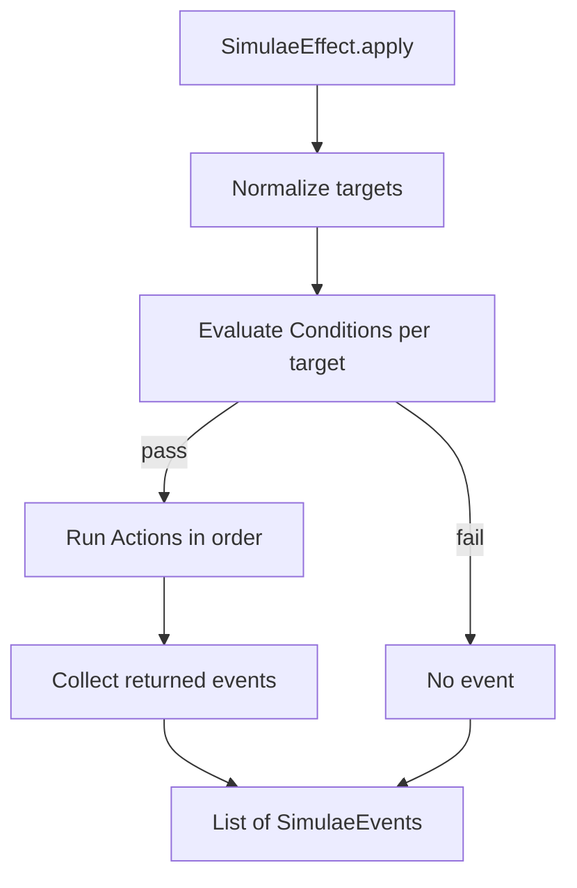

[[Simulae Effect]] is a condition-gated bundle of [[Simulae Action]] objects.

Effects are the main way [[SimulaeNode]] objects interact. A walking effect, a bandage effect, a light switch effect, and a damage effect are all examples of Simulae Effects.

## Implementation

`SimulaeEffect` is implemented as a meta [[SimulaeNode]] with nodetype `Effect`.

Core fields:
- `Conditions`: a list of [[Simulae Condition]] objects
- `Actions`: a list of [[Simulae Action]] objects

An effect:
1. Normalizes the target or target list.
2. Evaluates effect-level conditions for each target.
3. Applies actions in order to targets whose conditions pass.
4. Returns the [[Simulae Event]] objects created by those actions.
5. Optionally creates a summary event for the whole effect.

`apply()` accepts `targets`, `sources`, `observers`, and optional parent `effects`.

`apply()` returns only created [[Simulae Event]] objects.

## Features & Usage

Use an effect when an interaction has conditions and one or more actions.

Written examples:

- Walking:
  - Conditions:
    - actor has `Abilities.walk = enabled`
    - actor has a leg component
  - Actions:
    - decrement `Attributes.calories`
    - decrement `Attributes.oxygen`
    - update `References.location`

- Bandaging:
  - Conditions:
    - target has `Checks.bleeding = True`
  - Actions:
    - set `Checks.bleeding = False`
    - set `Abilities.heal = stabilized`
    - create a medical event

- Light switch:
  - Conditions:
    - light has `Checks.powered = True`
  - Actions:
    - set `Abilities.emit_light = on`
    - decrement `Attributes.electricity`

- Damage:
  - Conditions:
    - organ integrity is above `0`
  - Actions:
    - decrement `Attributes.integrity`
    - set `Checks.bleeding = True`
    - set an ability such as `Abilities.breathing = compromised`
    - create a physical damage event

- Aneurism IV Rot:
  - Conditions:
    - district `Attributes.rot >= 80`
  - Actions:
    - set `Checks.limitation_order = True`
    - create a city event

Returned events include the relevant action/effect details:
- event class, type, and subtype
- source IDs
- target IDs
- observer IDs
- effect IDs
- action metadata, when created by an action
- effect summary metadata, when requested

If no target passes the effect conditions, the effect returns no events.

Use [[Selector]] inside actions when only some targets from an effect should receive a specific action.
