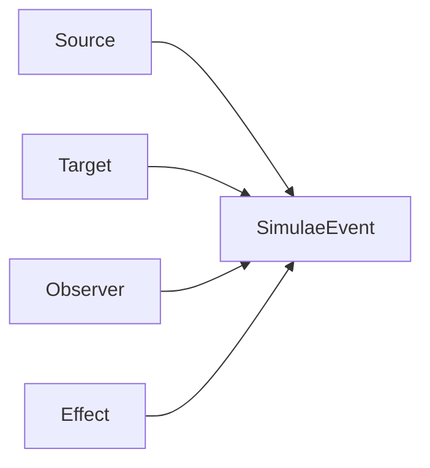

[[Simulae Event]] records something that happened in the world.

Actions and effects can create events so other systems can remember, display, or react to consequences.

## Implementation

`SimulaeEvent` is implemented as a [[SimulaeNode]] with nodetype `Event`.

Core fields:
- `References`: event metadata such as class, type, subtype, and timestamps
- `source_ids`: who or what caused the event
- `target_ids`: who or what was affected
- `observer_ids`: who or what observed it
- `Effects`: effect IDs that caused the event

Participant IDs are also mirrored into event relations for source, target, and observer lookups.

## Features & Usage

Use an event when a world update should be recorded.

Written examples:

- A bandage stabilizes bleeding:
  - Event class: `medical`
  - Event type: `stabilize`
  - Source: `bandage`
  - Target: `left-arm`

- A bullet punctures an organ:
  - Event class: `physical`
  - Event type: `damage`
  - Event subtype: `organ-puncture`
  - Source: `bullet`
  - Target: `lung`

Events should describe what happened. State changes themselves belong in [[Simulae Action]].
