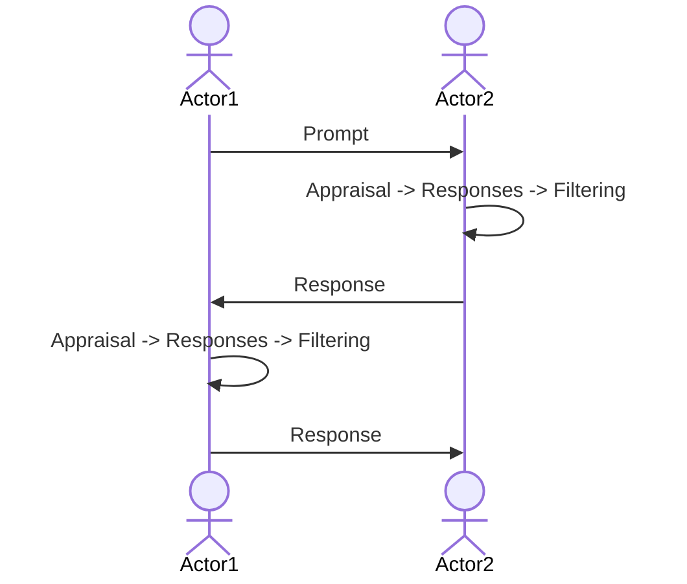
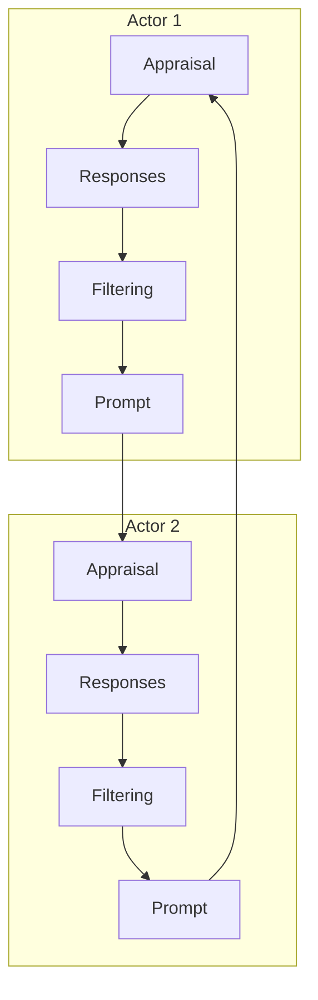

An appraisal is a given [[Simulae Actor]]s understanding / interpretation of a [[Social Event]]

# Test Scenarios
By [[Social Event]] type

- Open
	- Nonverbal greeting (head nod)
	- Simple greeting ("hello")
	- formal greeting
- Close
	- nonverbal (head nod)
	- 
- Turn
- Topic
- Inform
- Inquire
- Stance
- Influence
- Affect
- Direct
- Negotiate
- Coordinate
- Deceive
- Summary
