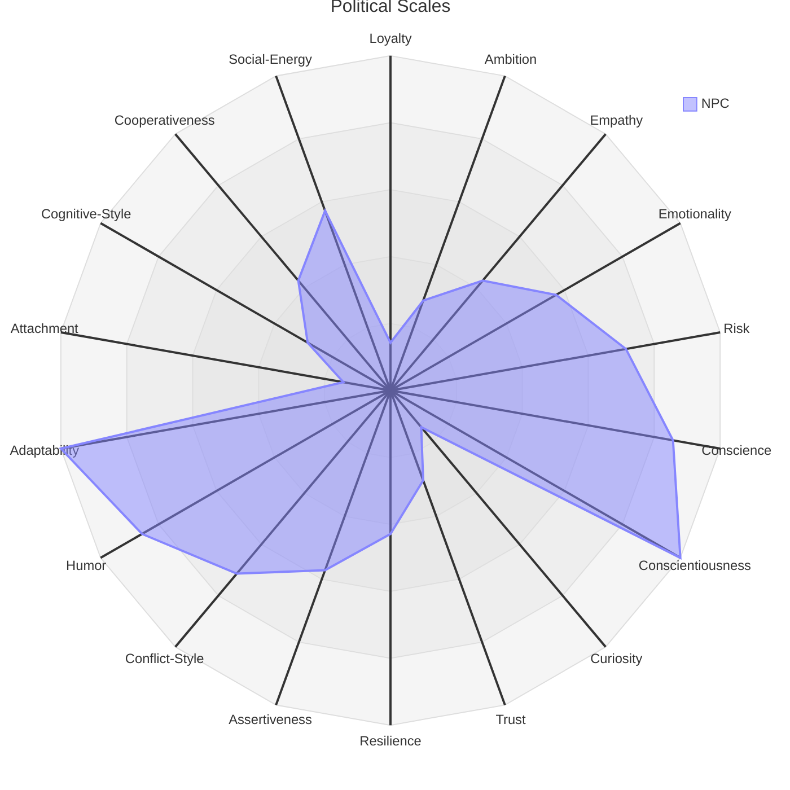

The Personality [[Scales]] are a series of axes that attempt to approximate the many aspects of a human psyche in a data structure through which can be calculated appropriate reactions, responses, and priorities of a given [[SimulaeNode/Simulae Actor]]'s interactions in the [[Socialization]]

## Scales

| Personality Factor | Low Extreme   |             |               | Neutral / Average |               |                  | High Extreme      |
| ------------------ | ------------- | ----------- | ------------- | ----------------- | ------------- | ---------------- | ----------------- |
| Agreeableness      | Hostile       | Unfriendly  | Aloof         | Neutral           | Friendly      | Agreeable        | Compassionate     |
| Extroversion       | Reclusive     | Withdrawn   | Quiet         | Neutral           | Sociable      | Gregarious       | Attention-seeking |
| Contientiousness   | Negligent     | Careless    | Irresponsible | Neutral           | Reliable      | Conscientious    | Perfectionist     |
| Neuroticism        | Cold          | Stable      | Calm          | Neutral           | Sensitive     | Anxious          | Fragile           |
| Openness           | Closed-Minded | Traditional | Conventional  | Inquisitive       | Investigative | Obsessive        |                   |
| Loyalty            | Rebellious    | Subversive  | Independent   | Indifferent       | Conformist    | Loyal            | Zealous           |
| Ambition           | Selfless      | Apathetic   | Unmotivated   | Steady            | Ambitious     | Selfish          | Messianic         |
| Empathy            | Sadistic      | Callous     | Apathetic     | Neutral           | Sympathetic   | Idealistic       | Virtuous          |
| Conscience         | Immoral       | Amoral      | Rational      | Pragmatic         | Ethical       | Idealistic       | Virtuous          |
| Trust              | Paranoid      | Distrustful | Skeptical     | Neutral           | Unsuspicious  | Trusting         | Gullible          |
| Humor              | Humorless     | Dry         | Reserved      | Neutral           | Witty         | Joker            | Clownish          |
| Attachment         | Avoidant      | Detached    | Reserved      | Neutral           | Affectionate  | Anxious          | Obsessive         |
| Cognitive-Style    | Concrete      | Practical   | Analytic      | Balanced          | Abstract      | Systems-Oriented | Visionary         |

## Diagram

![[personality-scales-diagram.png]]

