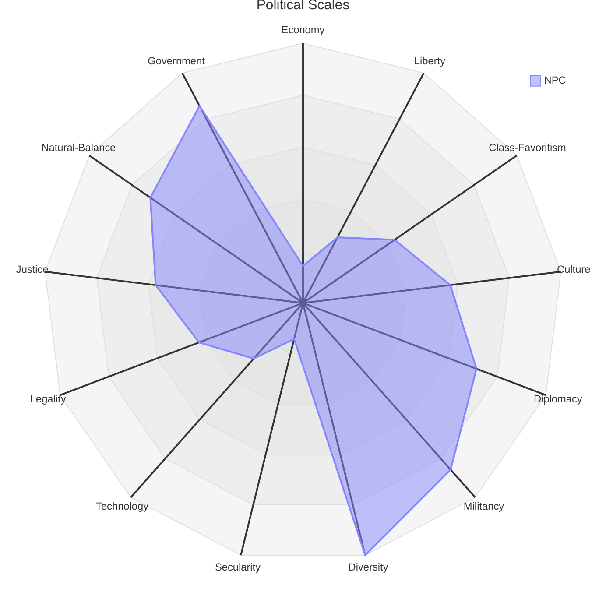

The Political [[Scales]] are a series of axes that attempt to represent a given entity's outlook on political topics

## Scales

| Personality Factor     | Low Extreme        |                  |                 | Neutral / Average |                 |                  | High Extreme     |
| ---------------------- | ------------------ | ---------------- | --------------- | ----------------- | --------------- | ---------------- | ---------------- |
| Economic Indivisualism | Communist          | Socialist        | Interventionist | Indifferent       | Capitalist      | Free-Capitalist  | Hyper-Capitalist |
| Liberty                | Totalitarianism    | Authoritarianism | Centralized     | Indifferent       | Liberal         | Libertarianism   | Anarchist        |
| Class-Favoritism       | Underclass         | Working-Class    | Populist        | indifferent       | Middle-Class    | Aristocratic     | Plutocratic      |
| Culture                | Reactionary        | Traditionalist   | Conservative    | Indifferent       | Progressive     | Accelerationist  | Post-Culturalist |
| Diplomacy              | Supranationalist   | Globalist        | Diplomatic      | Indifferent       | Patriotic       | Nationalist      | Isolationist     |
| Militancy              | Warhawk            | Militarist       | Forceful        | Indifferent       | Conflict-Averse | Nonviolent       | Pacifist         |
| Diversity              | Ethnocentrist      | Homogenist       | Preservationist | Indifferent       | Pluralist       | Multiculturalist | Inclusionist     |
| Secularity             | Atheist            | Apostate         | Secularist      | Indifferent       | Religious       | Devout           | Funamentalist    |
| Technology             | Technophobic       | Luddite          | Hesitant        | Indifferent       | Modernist       | Techno-Optimist  | Transhumanist    |
| Legality               | Lawless            | Arbitrary        | Pragmatic       | Indifferent       | Regulatory      | Proceduralist    | Legalist         |
| Justice                | Vengeful           | Retributive      | Punitive        | Indifferent       | Corrective      | Rehabilitative   | Abolitionist     |
| Natural Balance        | Eco-Absolutist     | Ecologist        | Conservationist | Indifferent       | Utilitarian     | Productivist     | Industrialist    |
| Government             | Popular-Democratic | Democratic       | Republican      | Indifferent       | Oligarchic      | Autocratic       |                  |

## Diagram

![[political-scales-diagram.png]]Diagram:

