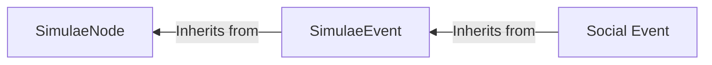

[[Social Event]]s are a subtype of a [[Simulae Event]] which specifically relates to the abstract concept of a 'social interaction' codified into a data structure formatted for use a [[SimulaeNode/Simulae Actor]] (Sentient Simulae Entity) which, through socialization, experiences and generates these events in doing so. 

## Types of Events

| Core Interactions | Subtypes                                                                   |
| ----------------- | -------------------------------------------------------------------------- |
| Open              | Greet, Initiate                                                            |
| Close             | Farewell, Withdrawl, sever-ties                                            |
| Turn              | Interrupt, Cede-priority, stall/filler (phatic)                            |
| Topic             | Change-Topic                                                               |
| Inform            | Claim (disclose, reveal, confess, observer, clarify, retract)              |
| Inquire           | ask, probe, challenge                                                      |
| Stance            | confirm/deny, agree/disagree, accept/refuse, validate/invalidate           |
| Influence         | persuade/dissuade, pressure, threaten                                      |
| Affect            | Comfort, commiserate, praise, criticize, insult, apologize, joke, complain |
| Direct            | Request, demand, command, task, delegate                                   |
| Negotiate         | offer, counteroffer                                                        |
| Coordinate        | Rally, organize, promote/demote, resign, accompany, plan, etc              |
| Deceive           | mislead, conceal, feign, impersonate, entrap, cover                        |
| Summary           | reflect (individual recap with transform?), summary (full recap)           |
## Qualifiers

Qualifiers are important metadata attached to a given [[Social Event]]s that indicate additional information and designate categories about it that may be relevant to interpretation.

- Domain 
	- Identity -- Relates to the identity of a [[SimulaeNode]] (Title, name, role, occupation, etc)
	- Fact -- A statement describing something. 
	- Plan -- Describes a [[Plan]]
	- Task -- An instruction 
	- Resource -- ...
- Honesty 
	- Truthful -- 
	- Deceptive -- 
	- Uncertain -- 
- Emotion -- Expression of a primary or derivative emotion
	- ...
- Authority -- The nature of authority between the source and receiver
	- Peer
	- Superior
	- Subordinate
	- None
	- Unknown
	- External 
- Time -- The time-range associated with the information (past/present/future-tense)
	- Current
	- Ongoing 
	- Future
		- Immediacy
	- Past
		- Recency

### Emotion Wheel

![[Pasted image 20260418192310.png]]
- Happy
	- Playful
		- Aroused
		- Cheeky
	- Content
		- Free
		- Joyful
	- Interested
		- Curious
		- Inquisitive
	- Proud
		- Successful
		- Confident
	- Accepted
		- Respected
		- Valued
	- Powerful
		- Courageous
		- Creative
	- Peaceful
		- Loving
		- Thankful
	- Trusting
		- Sensitive
		- Intimate
	- Optimistic
		- Hopeful
		- Inspired
- Sad
	- Hurt
		- Embarrased
		- Disappointed
	- Depressed
		- Inferior
		- Empty
	- Guilty
		- Ashamed
		- Remorseful
	- Despair
		- Grief
		- Powerless
	- Vulnerable
		- Victimized
		- Fragile
	- Lonely
		- Isolated
		- Abandoned
- Disgusted
	- Disapproving
		- Judgemental
		- Embarrassed
	- Disappointed
		- Appaled
		- Revolted
	- Awful
		- Neauseated
		- Detestable
	- Repelled
		- Horrified
		- Hesitant
- Angry
	- Let Down
		- Betrayed
		- Resentful
	- Humiliated
		- Disrespected
		- Ridiculed
	- Bitter
		- Indignant
		- Violated
	- Mad
		- Furious
		- Jealous
	- Aggressive
		- Provoked
		- Annoyed
	- Frustrated
		- Infuriated
		- Annoyed
	- Distant
		- Withdrawn
		- Numb
	- Critical
		- Skeptical
		- Dismissive
- Fearful
	- Scared
		- Helpless
		- Frightened
	- Anxious
		- Overwhelmed
		- Worried
	- Insecure
		- Inadequate
		- Inferior
	- Weak
		- Worthless
		- Insignificant
	- Rejected
		- Excluded
		- Persecurted
	- Threatened
		- Nervous
		- Exposed
- Surprised
	- Startled
		- Shocked
		- Dismayed
	- Confused
		- Disillusioned
		- Perplexed
	- Amazed
		- Astonished
		- Awe
	- Excited
		- Eager
		- Energetic
- Fatigued
	- Bored
		- Indifferent
		- Apathetic
	- Busy
		- Pressured
		- Rushed
	- Tired
		- Sleepy
		- Unfocused
	- Stressed
		- Overwhelmed
		- Out-of-Control
	

### Resolving `Inform` / `Inquire` Content

If an NPC has already selected `Inform` or `Inquire`, the next step is to resolve a **topic payload** (what exactly they are talking about).

Use this deterministic pipeline:

1. Build candidate topics from:
	- Prompting event (`social_event`) fields (`domain`, `topic`, `subject`, `claim`, `question`, `evidence`, `time`)
	- Recent `conversation_history` (prior asks/claims, with recency bias)
	- NPC memory buckets (claims, commitments, social threads, etc)
2. Normalize each candidate into:
	- `domain`
	- `topic`
	- `subject`
	- `details`
	- `evidence`
	- `time`
	- `source`
	- `certainty` and `salience` (internal scoring metadata)
3. Score candidates:
	- Base: `salience`
	- `Inform` boosts high-certainty items and unanswered recent inquiries
	- `Inquire` boosts low-certainty / weak-evidence / missing-field items
	- Boost same-domain and same-topic as the triggering event
4. Pick top score and emit a payload:
	- `Inform` -> `{ response_type: "Inform", intent: "answer_or_share", information_target: {...} }`
	- `Inquire` -> `{ response_type: "Inquire", intent: "ask_for_evidence|ask_for_timeframe|ask_for_subject|ask_for_clarification", inquiry_target: {...} }`

This separates:

- **Response selection** (what type of act to take)
- **Content resolution** (what information act to perform)
