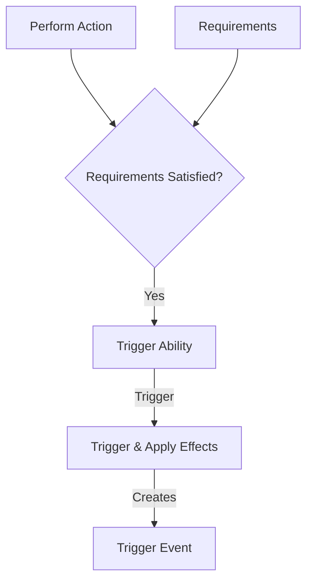

The abilities structure details the various actions that can be performed by the [[SimulaeNode]]. These actions may have:
- Requirements - set of [[Condition]]s that must be satisfied 
- [[Simulae Effect]]

```json
Ability = {
	'id': '...',
	'name': 'ability_name',
	'requirements': [...],
	'activation': 'activate',
	'effects': [
		...
	],
	
}
```





## Ability Requirements

The requirements for abilities, if applicable, can be combinations of physical components ([[SimulaeNode]]s) or satisfied states

> ex: A spell may require a `mana` level above 50 points and a spell-component such as a wand and/or a crystal which may be consumed in the process of casting

## Ability Activation Type

The `activation` property indicates what causes the ability to activate. 
There are a few kinds of default triggers:

| Activation | Description                                                               |
| ---------- | ------------------------------------------------------------------------- |
| Action     | Ability can be activated by choice                                        |
| Reaction   | Ability is activated by an event                                          |
| Passive    | Ability is always activate, and may trigger its effect events perpetually |
> note: The effect conditions must be satisfied in order to take effect.

# Ability Effects

An Ability's [[Simulae Effect]]s list are intentionally nebulous and configurable.
