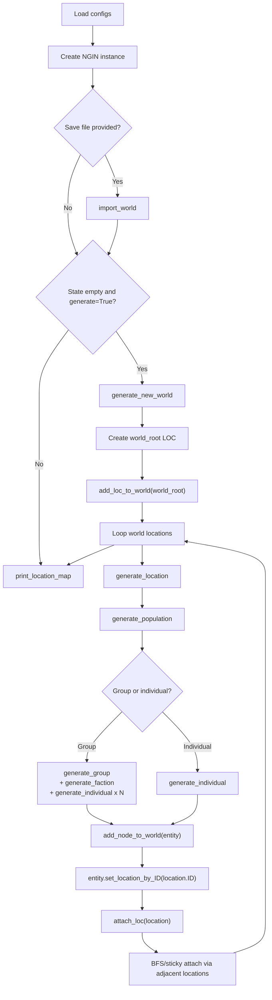
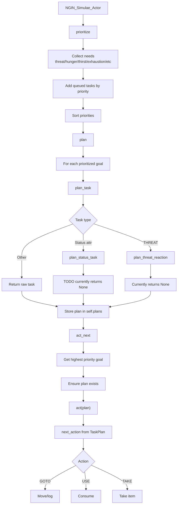
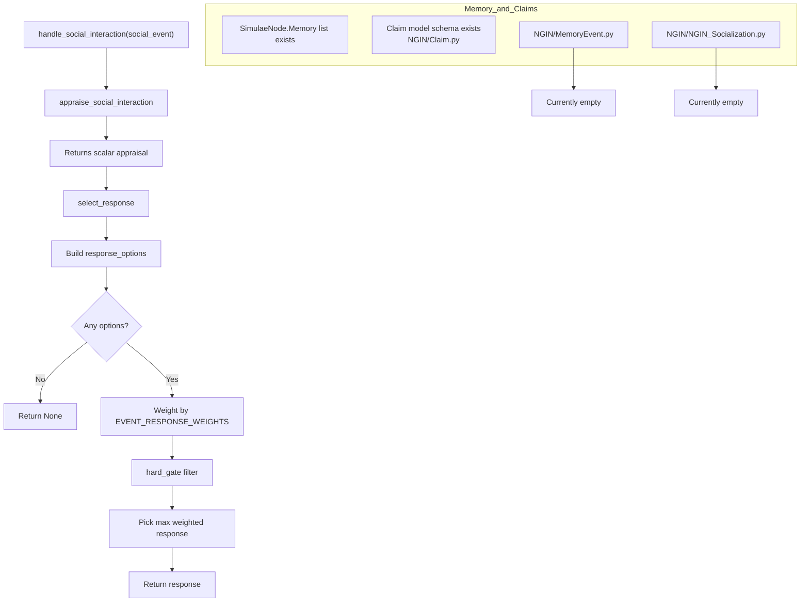

# CampaignGenerator (Simulae / NGIN)

Adaptive and modular campaign/world generator for RPG scenarios, with the 'Simulae' node object model, world generation, and early AI/socialization scaffolding.

## End Goals

The goal of this project is to achieve deterministic algorithms and data-model set that can perpetually dynamically ad-lib simulated worlds with intelligent actors 

These intelligent 'actors' will be able to have individualized:
- Goals and plans
    - They will be able to take high-level/vague goals and perform the necessary steps necessary to reach that end-state
    - Evaluate and act based on their own priorities which may help or inhibit themselves and others.
- Personalities & opinions that affect their choices and behaviors.
- Persistent memory of experienced events and information that will affect relationships with other nodes and actors.

All this with the intended goal of being able to use compounding emergent behaviors by stochastic agents to simulate immersive settings and narratives that both exist and self-propagate without, but dynamically and realistically react to, human-input.

> Any setting, any genre, any story, which you can either watch or actively participate in or shape.

The intention is a Dynamic-Narrative Immersive Sim engine, capable of functioning as an amalgamation and evolution of some existing games such as:
- Dwarf Fortress
- Rimworld
- Ultima
- The Elder Scrolls & Fallout
- Deus Ex
- Dishonored
- Far Cry
- Aneurism IV
- Social Deduction games (ex: Blood on the Clocktower, Mafia/Werewolf, Trouble in Terrorist Town)
- The Witcher
- STALKER
- Darkest Dungeon
- Shadows of Doubt
- Hitman
- Beta Decay (Rumored)

Features:
- Player-driven narratives.
    - Fulfill any role: Adventurer, Mercenary, Merchant, Diplomat, Inventor, Leader, Farmer, Mage, Assassin, Warlord, Mastermind, or agent of chaos
    - Join existing factions, rise and fall, or build their own faction, swaying other NPC's to your favor, and commanding others.
- Advanced NPCs
    - Individual personalities, quirks, goals, and political opinions that can be changed over time or by 'experienced' events and determine their behavior
    - Intelligent actions and decision-making logic
    - (Re)active actors. Some may betray you, some may become a rival, some may fall in love, others may be won over by your efforts.
- Dynamic narrative generation
    - Join a faction and rise to become a leader, start a war, win or lose, rule the world or die trying.
    - Start a cult or criminal empire and grow your power and influence, competing against rival organizations
    - Faction wars rage in the background, while NPCs live out their daily lives

## Project Status (Last Verified: July 31, 2026)

### Current Priorities

- NPC Planning, Decision Making, Memory, and basic socialization
    - [ ] Implement structured social memory events
    - [ ] Implement appraisal model for social interactions
    - [ ] Connect memory/claims/social-model updates to response selection
    - [ ] String prompts-to-responses pipelines together between multiple NPCs
- Basic Narratives
    - [ ] 
- Reimplement world generation
    - [ ] Generate a 'developed' world with history, cultures, factions, etc (generate initial state and let the world cook for many cycles)
        - [ ] variable engine simulation 'resolution'

### Project Goal Checklist Structure

- [ ] Core Data Model(s)
    - [x] `SimulaeNode` entity model (references, attributes, relations, checks, scales, memory list)
        - [x] Personality and policy scale generation for social nodes
        - [ ] Memory structure(s)
    - Information Models
        - [ ] 
    - Engine Models
        - [ ] `SimulaeEvent` model
        - [ ] `SimulaeTemplate` model 
    - NPC Implementation
        - [ ] `NGIN_Simulae_Actor` planning/prioritization scaffolding in `NGIN/NGIN_AI.py`
        - NPC AI
            - Goal Breakdown
                - [ ] Implementation
            - Decision Making
                - [ ] Prioritization
                - [ ] Goal/Task Heuristic(s)
                    - [ ] Basic status & need prioritization
                    - [ ] Goal prioritization
            - Socialization
                - [ ] Appraisals (interpretation of stimuli events)
                - [ ] Experiences (appraisals -> memories)
                - [ ] Responses (reactions to experiences based on memories, personality, opinions)
                    - [ ] Goal/Task (re)planning responses
                    - [ ] Socialization responses
                - [ ] Information relaying
                    - [ ] Conclusions & Deduction
- [ ] API
    - [ ] Setup
        - [ ] Flask API endpoint for campaign generation (`NGIN/api.py`)
        - [x] API run scripts (`run_api.ps1`, `run_api.sh`)
    - [ ] Database models
    - [ ] Core Data Models CRUD
    - [ ] Resolution handler
        - [ ] Resolution Queue API
- Visual Integration
    - [ ] Full UI/UX integration with complete gameplay loop
        - [x] Frontend client scaffold (`NGINClient/`, Vue + Vite)

- Utilities
    - [x] Serialization helpers (`toJSON`, `simulaenode_from_json`) and node factory helpers
- [x] Unit test coverage for current `SimulaeNode` behavior
- [ ] Relation search/filtering is fully implemented (`get_relations_by_criteria` is still a TODO placeholder)

### Design & Documentation Goals

- [ ] NPC AI Design
    - [ ] 
- [ ] Narratives & Implementation Designs

## System Diagrams

### World-Generator (`NGIN/SimulaeCampaignGenerator.py`)



### NGIN AI Task Planning (`NGIN/NGIN_AI.py`)



### NGIN AI Socialization / Memory (Current State)



## Quick Start

### Prerequisites
- [ ] Python 3 installed
- [ ] Node.js + npm installed (for `NGINClient`)
- [ ] Python dependencies installed:

```bash
pip install -r requirements.txt
```

### Run API

PowerShell:

```powershell
./scripts/run_api.ps1
```

Bash:

```bash
./scripts/run_api.sh
```

### Run Web Client (PowerShell)

```powershell
./scripts/start_nginclient.ps1
```

### Run Terminal Campaign Generator (PowerShell)

```powershell
./generate_campaign.ps1
```

### Run Unit Tests

- PowerShell

```powershell
./run_unittests.ps1
```

- Bash

```bash
./run_unittests.sh
```

### Run Unit Tests (non-script)

```bash
python3 -m unittest discover
```

or:

```bash
python -B -m unittest -v
```
