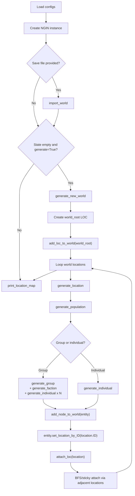
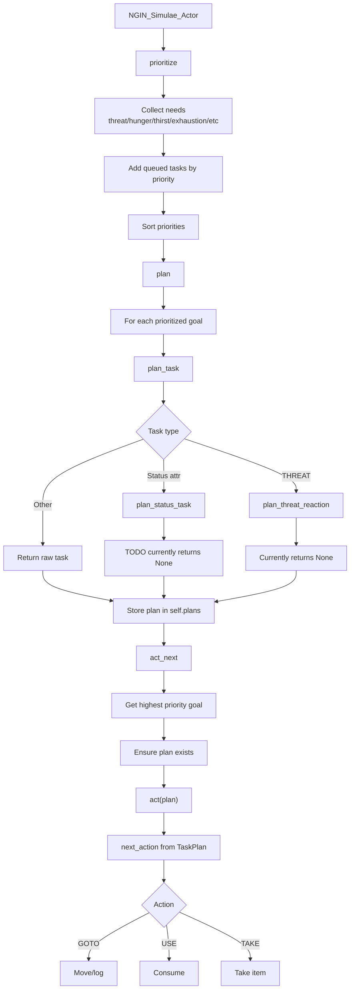
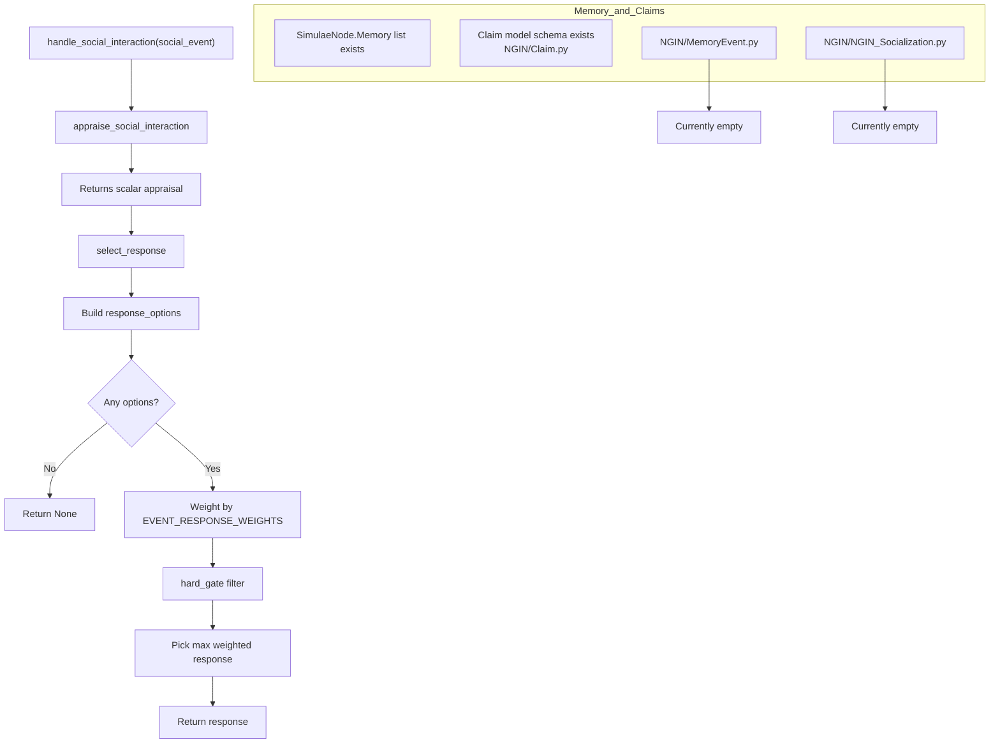

# CampaignGenerator (Simulae / NGIN)

Adaptive and modular campaign/world generator for RPG scenarios, with the 'Simulae' node object model, world generation, and early AI/socialization scaffolding.

## End Goals

The goal of this project is to achieve deterministic algorithms and data-model set that can perpetually dynamically ad-lib simulated worlds with intelligent actors 

These intelligent 'actors' will be able to have individualized:
- Goals and plans
    - They will be able to take high-level/vague goals and perform the necessary steps necessary to reach that end-state
    - Evaluate and act based on their own priorities which may help or inhibit themselves and others.
- Personalities & opinions that affect their choices and behaviors.
- Persistent memory of experienced events and information that will affect relationships with other nodes and actors.

All this with the intended goal of being able to use compounding emergent behaviors by stochastic agents to simulate immersive settings and narratives that both exist and self-propagate without, but dynamically and realistically react to, human-input.

> Any setting, any genre, any story, which you can either watch or actively participate in or shape.

Think of similar engines (in the context of interactive media) such as Dwarf Fortress, Rimworld, etc. but with:
- NPC's with individual personalities (and political opinions) that can be changed over time or by 'experienced' events and determine their behavior
- Player-driven narratives.
    - Fulfill any role. Adventurer, Mercenary, Merchant, Diplomat, Inventor, Leader, or just a Farmer
    - Build their own faction, swaying other NPC's to your favor, and commanding others.
    - (Re)active actors. Some may betray you, some may become a rival, some may fall in love, others may be won over by your efforts.
- Dynamic narrative generation
    - Join a faction, become a leader, start a war, win the war, become King
    - Start a cult or criminal empire and grow your power and influence.

## Project Status (Last Verified: February 17, 2026)

### Core Data Model
- [x] `SimulaeNode` entity model (references, attributes, relations, checks, scales, memory list)
- [x] Personality and policy scale generation for social nodes
- [x] Serialization helpers (`toJSON`, `simulaenode_from_json`) and node factory helpers
- [x] Unit test coverage for current `SimulaeNode` behavior
- [ ] Relation search/filtering is fully implemented (`get_relations_by_criteria` is still a TODO placeholder)

### World / Campaign Generation
- [x] `NGIN/SimulaeCampaignGenerator.py` main generator and console loop
- [x] Basic world/location/entity generation flow
- [x] Action selection and action-resolution scaffolding
- [ ] Mission outcomes are fully integrated into long-term world state
- [ ] Actor/non-actor behavior depth is complete (multiple TODOs remain)

### AI / Socialization
- [x] `NGIN_Simulae_Actor` planning/prioritization scaffolding in `NGIN/NGIN_AI.py`
- [x] Basic status-need checks (hunger/thirst/exhaustion/etc.)
- [x] Task planning and execution loop for survival needs and simple acquisition
- [ ] Encounter appraisal pipeline (`appraise_event`, `appraise_encounter`) implementation
- [ ] Social interaction appraisal/response ranking implementation

### Memory / Claims
- [x] Claim model skeleton exists (`NGIN/Claim.py`)
- [ ] Episodic memory event structure implementation (`NGIN/MemoryEvent.py` is currently empty)
- [ ] Socialization module implementation (`NGIN/NGIN_Socialization.py` is currently empty)
- [ ] Memory -> claim extraction -> social model update pipeline

### API / Client
- [x] Flask API endpoint for campaign generation (`NGIN/api.py`)
- [x] API run scripts (`run_api.ps1`, `run_api.sh`)
- [x] Frontend client scaffold (`NGINClient/`, Vue + Vite)
- [ ] Full UI/UX integration with complete gameplay loop

### Testing
- [x] Test suite currently runs and passes via `python -B -m unittest -v`
- [ ] Some tests are placeholder stubs with early `return` (notably in `NGIN/test_NGIN_AI.py`)

## System Diagrams

### World-Generator (`NGIN/SimulaeCampaignGenerator.py`)



### NGIN AI Task Planning (`NGIN/NGIN_AI.py`)



### NGIN AI Socialization / Memory (Current State)



## Quick Start

### Prerequisites
- [ ] Python 3 installed
- [ ] Node.js + npm installed (for `NGINClient`)
- [ ] Python dependencies installed:

```bash
pip install -r requirements.txt
```

### Run API

PowerShell:

```powershell
./run_api.ps1
```

Bash:

```bash
./run_api.sh
```

### Run Web Client (PowerShell)

```powershell
./start_nginclient.ps1
```

### Run Terminal Campaign Generator (PowerShell)

```powershell
./generate_campaign.ps1
```

### Run Unit Tests

- PowerShell

```powershell
./run_unittests.ps1
```

- Bash

```bash
./run_unittests.sh
```

### Run Unit Tests (non-script)

```bash
python3 -m unittest discover
```

or:

```bash
python -B -m unittest -v
```

## Current Priorities

- [ ] Implement structured social memory events
- [ ] Implement appraisal model for social interactions
- [ ] Connect memory/claims/social-model updates to response selection
- [ ] Finish mission outcome/state propagation
- [ ] Replace placeholder AI/socialization tests with full assertions
